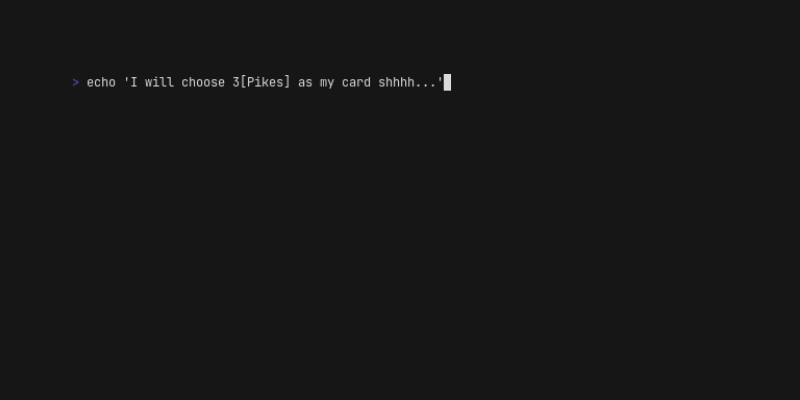

# card-guess

[](https://github.com/SchwarzIT/go-template)

This game will guess any card you choose between a random set of 21 cards.



The project uses `make` to make your life easier. If you're not familiar with Makefiles you can take a look at [this quickstart guide](https://makefiletutorial.com).

Whenever you need help regarding the available actions, just use the following command.

```bash
make help
```

## Run

To run the game type

```bash
make run
```

## Test & lint

Run linting

```bash
make lint
```

Run tests

```bash
make test
```
